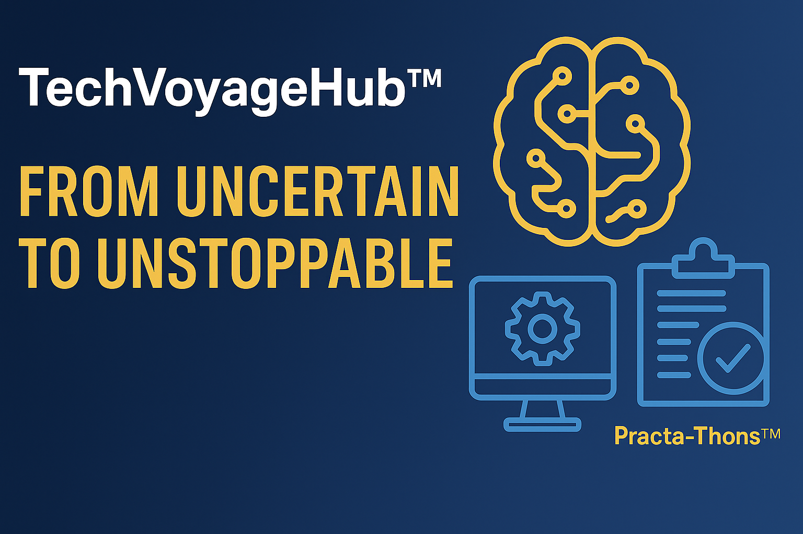

## Hi there 👋

  

---

### 🚀 Welcome to **TechVoyageHub™**

We’re not just another edtech brand.  
**TechVoyageHub™** is your career transformation partner in the age of AI, Cloud, and Data.

#### 🔍 What We Do

- ✅ Role-based upskilling (AI Engineers, Business Analysts, Risk Managers & more)
- ✅ Domain-specific AI programs (Finance, Retail, Insurance, Supply Chain)
- ✅ Real-world **Practa-Thons™** — simulation-based projects with execution-level depth
- ✅ Custom GPT, LLM workflows, automation, and agent-based AI

---

### 🧩 Featured Project Tracks

📂 `AI-Projects/` – End-to-end GenAI use cases with LangChain, GPT, Pinecone, FastAPI  
📂 `PractaThons/` – Project folders simulating real-world industry problems  
📂 `Templates/` – Ready-to-use blueprints for AI automation, prompt engineering & more  
📂 `KnowledgeGPT/` – Code + logic behind TVH’s own assistant and webinar bot

---

### 📣 Want to Learn More?

🌐 [Visit thetechvoyagehub.com](https://thetechvoyagehub.com)  
📬 [Email us](mailto:connect@thetechvoyagehub.com)  
📷 [Follow us on LinkedIn](https://www.linkedin.com/company/techvoyagehub)

---

> 🧠 *From uncertain to unstoppable — with a path that works.*

<!--
**techvoyagehub/techvoyagehub** is a ✨ _special_ ✨ repository because its `README.md` (this file) appears on your GitHub profile.

Here are some ideas to get you started:

- 🔭 I’m currently working on ...
- 🌱 I’m currently learning ...
- 👯 I’m looking to collaborate on ...
- 🤔 I’m looking for help with ...
- 💬 Ask me about ...
- 📫 How to reach me: ...
- 😄 Pronouns: ...
- ⚡ Fun fact: ...
-->
